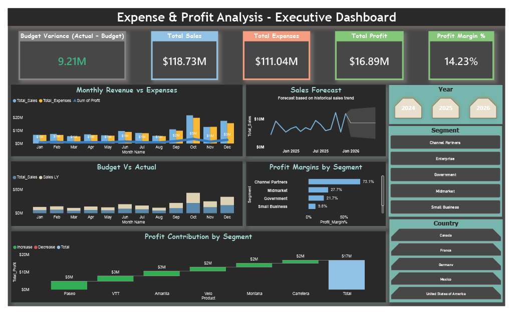

# Expense & Profit Analysis Dashboard

## 🎯 Business Objective
To provide leadership with a clear view of sales performance, expenses, and profitability in order to support data-driven financial decisions.

---

## 📊 Key KPIs Tracked
- Total Sales
- Total Expenses
- Net Profit
- Profit Margin %
- Budget Variance

---

## 🔍 Key Insights
- Analyzed **$118.73M in total sales** across business segments
- Identified **$9.21M budget variance** impacting profitability
- Highlighted high-margin and low-margin segments
- Enabled quick comparison across Year, Segment, and Product

---

## 🛠 Tools Used
- Power BI
- DAX
- Financial Data Modeling

---

## 📷 Dashboard Preview

### Profit Analysis

